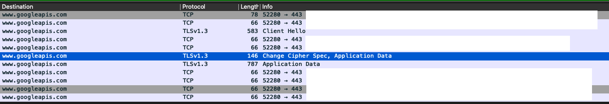

# pub-sub-test

## Run
```bash
export GOOGLE_APPLICATION_CREDENTIALS=~/Documents/t
node listenForMessages.js
```

```bash
export GOOGLE_APPLICATION_CREDENTIALS=~/Documents/t
node publishMessage.js
```

